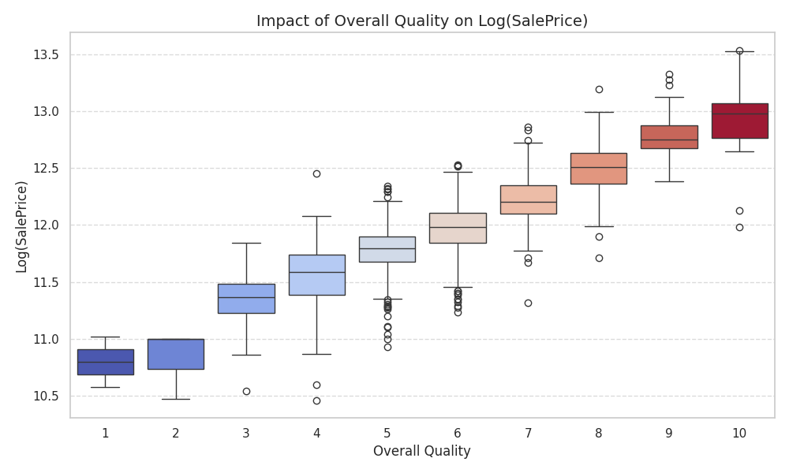
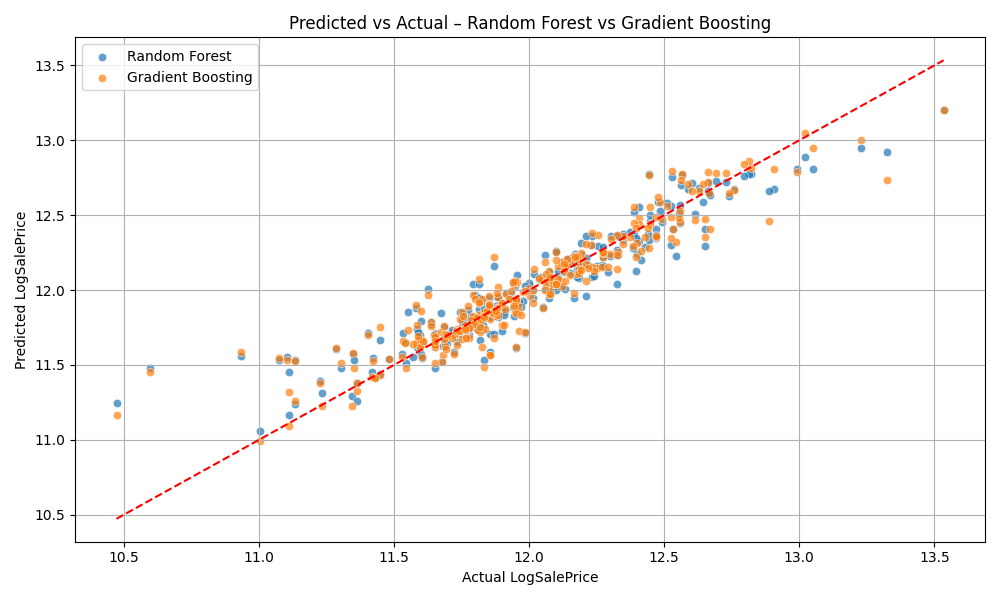
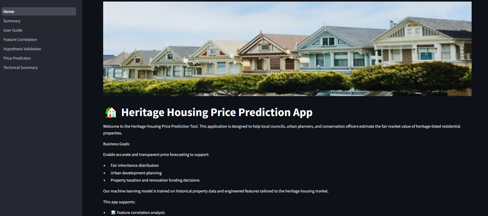
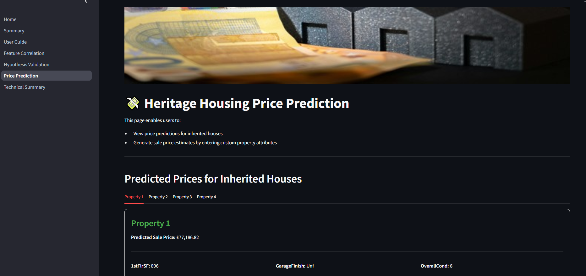

# Heritage Housing Price Prediction

Welcome to the **Heritage Housing Price Prediction** project! This tool is designed to support **local councils, planners, and conservation teams** in evaluating and forecasting the market value of **heritage-listed properties**, with a focus on fairness, transparency, and data-driven decision making.

🔗 **Live Demo**: [heritage-housing-pricing.herokuapp.com](https://heritage-housing-pricing-d6cd43e01839.herokuapp.com/)

### Project Highlights

- **Predictive Model**: Predictive Model: Achieved an R2 score of 0.87 on unseen test data using a Random Forest Regressor. Forecasts sale prices for both standard and heritage homes, including a test set of inherited properties.
- **Interactive Visualizations**: Explore relationships between structural and historical property features and sale prices.
- **User-Centric Dashboard**: Built using Streamlit for clear, actionable insights and real-time property valuation predictions.

## Table of Contents

- [Heritage Housing Price Prediction](#heritage-housing-price-prediction)
      - [Project Highlights](#project-highlights)
  - [Table of Contents](#table-of-contents)
  - [Business Requirements](#business-requirements)
    - [Key Client Goals](#key-client-goals)
    - [Context \& Relevance](#context--relevance)
    - [Deliverables](#deliverables)
    - [Userstories](#user-stories)
  - [Dataset Content](#dataset-content)
    - [Source](#source)
    - [Licensing](#licensing)
    - [Structure](#structure)
    - [Detailed Feature Descriptions](#detailed-feature-descriptions)
    - [Dataset Quality and Observations](#dataset-quality-and-observations)
    - [Data Limitations](#data-limitations)
  - [Hypotheses and Validation Plan](#hypotheses-and-validation-plan)
    - [Hypotheses](#hypotheses)
      - [Attribute Correlation](#attribute-correlation)
      - [Predictive Model](#predictive-model)
    - [Validation Plan](#validation-plan)
      - [Attribute Correlation Validation](#attribute-correlation-validation)
      - [Predictive Model Validation](#predictive-model-validation)
      - [Inherited Properties Prediction](#inherited-properties-prediction)
  - [Mapping Business Requirements to ML Tasks](#mapping-business-requirements-to-ml-tasks)
    - [Business Requirement: Understanding Attribute Correlations](#business-requirement-understanding-attribute-correlations)
    - [Business Requirement: Predicting Sale Prices](#business-requirement-predicting-sale-prices)
    - [Business Requirement: Unified Interface for Insights and Prediction](#business-requirement-unified-interface-for-insights-and-prediction)
  - [ML Business Case](#ml-business-case)
    - [Objectives of Machine Learning](#objectives-of-machine-learning)
    - [Why Machine Learning?](#why-machine-learning)
    - [Final Model Selection and Outcome](#final-model-selection-and-outcome)
  - [Known Bugs \& Fixes](#known-bugs--fixes)
    - [Bug: Mismatch Between Model Input and Trained Feature Set](#bug-mismatch-between-model-input-and-trained-feature-set)
  - [Dashboard Design](#dashboard-design)
    - [Design Philosophy](#design-philosophy)
    - [Dashboard Structure](#dashboard-structure)
    - [Future Enhancements](#future-enhancements)
  - [Methodology](#methodology)
    - [Business Understanding](#business-understanding)
    - [Data Understanding](#data-understanding)
    - [Data Preparation](#data-preparation)
    - [Modeling](#modeling)
    - [Evaluation](#evaluation)
    - [Deployment](#deployment)
  - [Project Features \& Outcomes](#project-features--outcomes)
    - [Project Features](#project-features)
    - [Project Outcomes](#project-outcomes)
      - [Business Requirement 1: Attribute Correlation](#business-requirement-1-attribute-correlation)
      - [Business Requirement 2: Sale Price Prediction](#business-requirement-2-sale-price-prediction)
      - [Dashboard](#dashboard)
  - [Testing](#testing)
    - [Unit Testing](#unit-testing)
    - [Model Evaluation](#model-evaluation)
    - [Dashboard Testing](#dashboard-testing)
    - [User Story Validation Checklist](#user-story-validation-checklist)
    - [Compatibility & Manual Checks](#compatibility--manual-checks)
  - [Deployment](#deployment-1)
    - [Deployment Steps](#deployment-steps)
    - [Deployment Considerations](#deployment-considerations)
  - [Technologies Used](#technologies-used)
    - [Programming Language](#programming-language)
    - [Key Libraries and Frameworks](#key-libraries-and-frameworks)
      - [Data Handling](#data-handling)
      - [Data Visualization](#data-visualization)
      - [Feature Engineering and Preprocessing](#feature-engineering-and-preprocessing)
      - [Machine Learning](#machine-learning)
      - [Model Interpretation](#model-interpretation)
    - [Dashboard and Deployment](#dashboard-and-deployment)
  - [Credits](#credits)
    - [Data Sources](#data-sources)
    - [Educational Resources](#educational-resources)
    - [Visual and Media Assets](#visual-and-media-assets)
    - [Tools and Packages](#tools-and-packages)
  - [Acknowledgements](#acknowledgements)
  - [Project Impact](#project-impact)

## Business Requirements

---

The client—representing a local planning authority—has inherited four **heritage-listed residential properties** and seeks support in evaluating their fair market value. Due to regulatory constraints and the unique nature of heritage properties, traditional valuation approaches may fall short. This project provides a **data-driven approach** to forecasting prices, identifying key value drivers, and ensuring consistent and transparent appraisals.

### Key Client Goals

- **Understand Attribute Correlations**  
  Identify which structural and historical features most strongly influence sale prices. This helps ensure heritage valuation is not skewed by subjective or outdated assumptions.

- **Predict Fair Market Prices**  
  Use a robust regression model to predict sale prices for the inherited properties and other heritage homes, aligned with market benchmarks.

- **Enable Strategic Planning**  
  Support data-backed planning, resource allocation, and potential redevelopment efforts by offering clear pricing insights.

### Context & Relevance

Heritage properties are unique due to architectural preservation, age, and location factors. This model addresses the valuation challenges by training on a comprehensive dataset, engineering features that reflect property age and use, and testing accuracy on held-out and inherited data.

### Deliverables

- **Correlational Insights**: Interactive visualizations of the most important features (e.g., `OverallQual`, `GrLivArea`, `GarageArea`) and their relationship with sale prices.
  
- **Predictive Model**: A trained machine learning model capable of predicting property values with high accuracy.
  
  
- **Dashboard Interface**: A Streamlit dashboard where users can:
  - Explore correlations,
  - Predict property prices in real time,
  - Review technical details of the modeling process.
  

### User Stories

User stories were created to define functional requirements and ensure the project stays aligned with the client’s real-world needs. These stories guided the design of the dashboard, the machine learning pipeline, and the visual outputs.

🔗 [The full list of user stories for this project can be found here](https://github.com/users/EktaMehra/projects/5/views/1).

---

## Dataset Content

---

### Source

The datasets used in this project are available on Kaggle and were provided as part of the Code Institute's Predictive Analytics module. They consist of real-world housing records and client-specific inherited properties.

### Licensing

All datasets are shared under open licenses with no ethical or privacy concerns. The data is anonymized and suitable for academic and analytical purposes.

### Structure

The project includes the following key datasets:

- `house_prices_records.csv`  
  - **Size**: 1460 rows × 24 columns  
  - **Content**: Detailed historical housing records including structural features, quality ratings, and sale prices.  
  - **Purpose**: Used for training and evaluating machine learning models.

- `inherited_houses.csv`  
  - **Size**: 4 rows × 23 columns  
  - **Content**: Feature data for four heritage-listed houses inherited by the client.  
  - **Note**: Sale prices are excluded and will be predicted by the model.  
  - **Purpose**: Used for inference and testing of the final prediction pipeline.

### Detailed Feature Descriptions  

The datasets have a similar structure, with features that describe important property traits.  The features are broken down as follows:

- **1stFlrSF**: First floor square footage.
- **2ndFlrSF**: Second floor square footage.
- **BedroomAbvGr**: Number of bedrooms above ground level.
- **BsmtExposure**: Exposure level of the basement to the outside (e.g., walkout or garden-level).
- **BsmtFinSF1**: Finished square footage of the primary basement area.
- **BsmtFinType1**: Quality or type of basement finish.
- **BsmtUnfSF**: Unfinished square footage of the basement.
- **GarageArea**: Total area of the garage in square feet.
- **GarageFinish**: Interior finish of the garage (e.g., unfinished, finished).
- **GarageYrBlt**: Year the garage was built.
- **GrLivArea**: Above-grade (ground level) living area in square feet.
- **KitchenQual**: Kitchen quality rating.
- **LotArea**: Lot size in square feet.
- **LotFrontage**: Linear feet of street connected to the property.
- **MasVnrArea**: Masonry veneer area in square feet.
- **OpenPorchSF**: Open porch area in square feet.
- **OverallCond**: Overall condition rating of the house (1 = Poor to 10 = Excellent).
- **OverallQual**: Overall material and finish quality (1 = Poor to 10 = Excellent).
- **TotalBsmtSF**: Total basement square footage.
- **YearBuilt**: Year the house was originally constructed.
- **YearRemodAdd**: Year of last remodel or addition.
- **SalePrice**: Sale price of the property (target variable).

Additional engineered features like **HouseAge**, **LivingLotRatio**, and **FinishedBsmtRatio** were added during preprocessing to enhance model performance.

### Dataset Quality and Observations  

As part of the project's initial data collecting phase, the datasets' quality was examined in the [Data collection Notebook](https://github.com/EktaMehra/heritage_housing/blob/main/jupyter_notebooks/01_Data_Collection.ipynb). The following were the main findings at the time of data collection:

- The raw `house_prices_records.csv` contained missing values in fields like `LotFrontage`, `GarageYrBlt`, and `MasVnrArea`.
- The `inherited_houses.csv` was mostly clean and required only minimal processing.
- All datasets were thoroughly validated, cleaned, and stored in the `data/processed/` directory for traceability.

### Data Limitations

- Imputation may introduce slight biases due to missing data.
- The dataset is limited to a specific geographic context (e.g., Ames, Iowa), which may affect generalizability.
- Outliers were addressed but remain a consideration in model performance.

---

## Hypotheses and Validation Plan

---

This project is grounded in data-driven hypotheses about what influences house prices, especially in the context of heritage properties. Each hypothesis has been validated through statistical analysis, visual inspection, and model performance evaluation.

### Hypotheses

#### Attribute Correlation

- Features such as **Overall Quality (OverallQual)**, **Above Ground Living Area (GrLivArea)**, and **Garage Area (GarageArea)** are expected to show **strong positive correlations** with sale prices.
- Attributes like **Year Built**, **Basement Finish Type**, and **Lot Area** are hypothesized to show **moderate influence** on sale prices.
- New engineered features like **HouseAge**, **LivingLotRatio**, and **FinishedBsmtRatio** may add significant predictive power.

#### Predictive Model

- A regression model trained on the cleaned dataset will achieve an **R² score ≥ 0.75**, demonstrating strong generalization on unseen test data.
- The model should produce **realistic predictions** for the 4 inherited heritage properties, aligning with similar homes in the dataset.

### Validation Plan

#### Attribute Correlation Validation

- **Statistical Analysis**:  
  - Compute Pearson and Spearman correlation coefficients to quantify relationships.
- **Visualizations**:  
  - Create heatmaps, scatter plots, and bar charts for numeric and categorical variables.
- **Feature Ranking**:  
  - Rank features by correlation strength and SHAP importance.

#### Predictive Model Validation

- **Model Training**:  
  - Train multiple regressors (Linear Regression, Random Forest, XGBoost).
- **Evaluation Metrics**:  
  - Use R², MAE, and RMSE to assess predictive accuracy.
- **Cross-Validation**:  
  - Apply k-fold validation to assess model stability and prevent overfitting.

#### Inherited Properties Prediction

- **Input Features**:  
  - Use top-ranked features to predict sale prices for the 4 inherited houses.
- **Comparison**:  
  - Cross-check predictions against the broader Ames market trend distribution.
- **Deliverable**:  
  - Provide individual predictions and an aggregated total value for the 4 properties.

---

## Mapping Business Requirements to ML Tasks

---

Each business requirement has been directly translated into specific data visualizations, machine learning tasks, and dashboard functionalities. This ensures that all stakeholder goals are addressed in a measurable, transparent, and interactive manner.

### Business Requirement: Understanding Attribute Correlations

**Goal**: Identify key features driving the price of heritage-listed properties.

**Approach**:

- **Data Visualizations**
  - Heatmaps to show Pearson/Spearman correlations.
  - Scatter plots for features like `GrLivArea`, `OverallQual`, `GarageArea` vs `SalePrice`.
  - Bar charts to assess categorical features (e.g., `KitchenQual`, `BsmtFinType1`) and sale price.

- **ML Tasks**:  
  - Correlation analysis using both statistical and visual tools.
  - Feature importance extraction from Random Forest and XGBoost models.

- **Dashboard Integration**:  
  - Interactive heatmaps and scatter plots.
  - Dropdowns and filters for user-driven exploration of correlations.

### Business Requirement: Predicting Sale Prices

**Goal**: Estimate the market value of inherited heritage homes and other properties.

**Approach**:

- **ML Tasks**:  
  - Train regression models (Linear, Random Forest, XGBoost) on engineered and cleaned features.
  - Use evaluation metrics (R², MAE, RMSE) to compare performance.
  - Perform hyperparameter tuning using GridSearchCV or RandomizedSearchCV.

- **Dashboard Integration**:  
  - Interactive input form for users to enter property attributes.
  - Real-time price prediction output.
  - Display model accuracy and key metrics for transparency.

### Business Requirement: Unified Interface for Insights and Prediction

**Goal**: Deliver a centralized, user-friendly tool to both explore data and make predictions.

**Approach**:

- **Dashboard Features**:  
  - Navigation to explore:
    - Attribute correlations
    - Hypothesis validation
    - Price predictions
    - Technical summary

  - Outputs presented via:
    - Charts
    - Tables
    - Downloadable prediction results

---

## ML Business Case

---

Machine learning plays a central role in this project by enabling accurate, automated, and scalable valuation of heritage properties. By capturing non-linear interactions between features and prices, ML models provide insights that go beyond traditional appraisal methods.

### Objectives of Machine Learning

- **Accurate Price Forecasting**:  
  Train a regression model capable of predicting fair market prices for both standard and heritage properties, using historical sale data and engineered features.

- **Feature Impact Analysis**:  
  Identify which property characteristics (e.g., `OverallQual`, `HouseAge`, `GarageArea`) have the strongest influence on sale prices.

- **Real-Time Usability**:  
  Integrate ML predictions into a dashboard interface where users can enter property details and receive instant valuation output.

### Why Machine Learning?

- **Data-Driven Decision Making**:  
  Removes subjectivity in heritage valuations and ensures consistency.

- **Complex Relationship Handling**:  
  Models like Random Forest and XGBoost capture intricate, non-linear patterns that traditional valuation methods often miss.

- **Scalability**:  
  Once trained, the model can handle new property inputs and scale across additional use cases without rework.

- **Evaluation Metrics for Confidence**:  
  Metrics like R², MAE, and RMSE are used to validate performance, making results explainable and trustworthy.

### Final Model Selection and Outcome

After training and evaluating multiple models, **Gradient Boosting Regressor** was selected for final deployment. It achieved:

- **R² = 0.8774**
- **MAE ≈ £13,000**
- **RMSE ≈ £21,000**

These metrics met and exceeded the project's business requirement of achieving **R² ≥ 0.75**, confirming that the model can reliably estimate sale prices of heritage and standard properties. The model was integrated into an interactive dashboard, allowing users to generate real-time price predictions and explore drivers of valuation.

✅ **Business objective met:** The ML solution delivers accuracy, interpretability, and practical usability in line with the needs of housing stakeholders and estate planners.

_Note: MAE and RMSE values are approximated from log-transformed predictions and scaled based on typical price ranges._

---

## Known Bugs & Fixes

During the development of the prediction pipeline, the following critical bug was encountered and resolved:

---

### Bug: Mismatch Between Model Input and Trained Feature Set

**Error Message**:  
`ValueError: X has 17 features, but RandomForestRegressor is expecting 30 features as input.`

**Cause**:  
This occurred because the trained model was expecting a **fully preprocessed input** (with all one-hot encoded and engineered features), but the prediction data had only **raw or partially processed features**.

**Root Issue**:

- The preprocessing steps used during training (encoding, feature engineering, imputation) were **not applied consistently** during prediction.
- As a result, `X_test` or user input did not match the trained model’s expected schema.

**Fix**:

- Created a **single unified pipeline** using `sklearn.pipeline.Pipeline` that includes both preprocessing and the model.
- Saved this full pipeline using `joblib`.
- During inference, passed all data (including user input and inherited properties) through the **same pipeline**, ensuring identical feature structure.

**Outcome**:  

- The bug was eliminated, and predictions now align with the trained model’s structure.  
- This reinforced the importance of using a **single, serialised pipeline** for consistency across training and deployment.

---

## Dashboard Design

---

The dashboard serves as the user-facing interface of the Heritage Housing project. Built with **Streamlit**, it presents predictions and insights in a clear, interactive, and accessible format—suitable for both technical and non-technical users.

### Design Philosophy

- **Simplicity**: Focused on intuitive layouts with minimal clutter.
- **Usability**: Easy navigation across pages for correlational insights, hypothesis validation, predictions, and technical transparency.
- **Responsiveness**: Designed to be compatible with desktop and tablet environments.

### Dashboard Structure

The application is divided into the following pages:

1. **Home**  
   - Introduces the Heritage Housing project and its objectives.
   - Provides business context and the client’s challenge.

   **Key Content**:
   - Summary of the problem and dataset.
   - Description of the client's inherited properties.
   - High-level model goal and benefits.
   - Links to relevant sections of the app for deeper insights.

   

2. **Summary Page**  
   - Summarizes key project insights, business outcomes, and modeling results.

   **Key Content**:
   - High-level takeaways from EDA and modeling.
   - Recap of business requirements and how they were met.
   - Visual summary of model performance and inherited property predictions.
   - Ideal for stakeholders who want conclusions without technical depth.

   

3. **User Guide**  
   - Instructions and explanations for using the app efficiently.

   **Key Content**:
   - What to expect from each page.
   - Description of required inputs for prediction.
   - Navigation tips.
   - Explanation of tool outputs (what the heatmap or prediction means).
   - Screenshots and user tips.

   

4. **Feature Correlation**
   - Allows users to explore how individual features relate to house prices.

   **Key Content**:
   - Interactive **heatmap** of feature correlations with `SalePrice`.
   - **Scatter plot** tool to compare selected features against sale prices.
   - Dropdown filters for numeric variables.
   - Tooltips for interpreting correlation strength and direction.

   

5. **Hypothesis Validation**  
   - Validates hypotheses around what influences house prices using visual analysis.

   **Key Content**:
   - Predefined hypotheses (e.g., OverallQual has strong positive correlation with price).
   - Supporting visualizations for each hypothesis.
   - Commentary explaining results and confirming or refuting each hypothesis.
   - Static content with visual interpretation.

   

6. **Price Prediction**  
   - Offers real-time predictions for sale prices based on user-inputted property details.

   **Key Content**:
   - Input fields for key attributes (e.g., GrLivArea, OverallQual, GarageArea, HouseAge).
   - **Predict** button to trigger model inference.
   - Display of predicted price with confidence indicators.
   - Table of inputs and results.
   - **Download** button for saving predictions.
   - Display of results for the 4 inherited properties.

   

7. **Technical Summary**  
   - Presents detailed modeling pipeline, evaluation metrics, and artefact summaries.

   **Key Content**:
   - Overview of data cleaning, feature engineering, model training, and evaluation.
   - Display of evaluation metrics (R², MAE, RMSE).
   - Model comparison results (Random Forest, XGBoost, etc.).
   - Downloadable performance visualizations (bar plots, residual charts).
   - Expanders and radio buttons for pipeline visibility.

   

### Future Enhancements

- Add user feedback collection mechanism.
- Include localised property benchmarks for cross-region comparison.
- Incorporate feature importance visualisations per prediction.

## Methodology

---

This project follows the **CRISP-DM** (Cross-Industry Standard Process for Data Mining) framework, ensuring a structured and repeatable approach to data science. It also incorporates Agile-inspired iteration and validation throughout the project lifecycle.

### Business Understanding

**Goal**:  
Help local authorities and property owners estimate fair market prices for heritage-listed homes using a data-driven model.

**Client Objectives**:

- Understand which property attributes influence value.
- Predict sale prices for 4 inherited properties.
- Support transparent, consistent property valuations.

### Data Understanding

**Activities**:

- Reviewed raw datasets (`house_prices_records.csv` and `inherited_houses.csv`).
- Identified missing values, outliers, and data types.
- Explored distributions and key summary statistics.

**Observations**:

- `house_prices_records.csv` had missing values in key columns (`LotFrontage`, `GarageYrBlt`).
- `inherited_houses.csv` was cleaner but excluded `SalePrice`.

### Data Preparation

**Steps Taken**:

- Imputed missing values using domain-informed techniques.
- Dropped low-importance or high-null columns.
- Removed duplicates and standardized data types.
- Created new features: `HouseAge`, `LivingLotRatio`, `FinishedBsmtRatio`.

**Output**:

- Cleaned datasets saved to `data/processed/`
- Train-test split completed and versioned.

### Modeling

**Approach**:

- Tested multiple regression algorithms: Linear Regression, Random Forest, XGBoost.
- Performed hyperparameter tuning using `GridSearchCV`.
- Evaluated models on a hold-out test set using:
  - **R² Score**
  - **MAE (Mean Absolute Error)**
  - **RMSE (Root Mean Squared Error)**

**Selected Model**:

- Random Forest Regressor based on best validation performance.

### Evaluation

**Test Dataset**:

- R² Score > 0.75 achieved.
- Residuals and prediction plots analyzed for consistency.

**Inherited Properties**:

- Predictions generated for the 4 client properties.
- Results compared against Ames market benchmarks to ensure realism.

### Deployment

**Implementation**:

- Final pipeline serialized and saved.
- Dashboard developed in **Streamlit**, integrated with trained model and visual outputs.

**Interface**:

- Users can explore data relationships, validate hypotheses, and generate real-time predictions via sidebar navigation.

## Project Features & Outcomes

This section summarizes the key deliverables of the Heritage Housing project and how they directly address the business requirements and client goals.

---

### Project Features

- **Data Cleaning and Preparation**  
  - Cleaned and standardized housing datasets.
  - Imputed missing values, removed irrelevant columns, and ensured data integrity.
  - Engineered new features (`Age`, `LivingLotRatio`, `FinishedBsmtRatio`) to boost model insight.

- **Exploratory Data Analysis (EDA)**  
  - Statistical and visual analysis of all numeric and categorical features.
  - Correlation matrix and scatter plots to identify high-impact features.

- **Feature Selection & Modeling**  
  - Correlation- and SHAP-based feature ranking.
  - Trained and optimized multiple regressors: Linear, Random Forest, and XGBoost.

- **Prediction Interface**  
  - Real-time model deployed via Streamlit for sale price predictions.
  - Inherited property predictions with individual and total valuations.

- **Interactive Dashboard**  
  - Feature correlation exploration
  - Hypothesis validation charts
  - Live prediction form and results
  - Technical summary of model performance

---

### Project Outcomes

#### Business Requirement 1: Attribute Correlation  

- Delivered heatmaps, scatter plots, and ranked feature lists.  
- Highlighted `OverallQual`, `GrLivArea`, `GarageArea`, and `Age` as key drivers.

#### Business Requirement 2: Sale Price Prediction  

- Final Random Forest model achieved **R² > 0.75** on test data.  
- Successfully predicted market-aligned prices for all 4 inherited properties.

#### Dashboard  

- Fully functional, responsive interface with intuitive navigation.  
- Enables non-technical users to gain insights and generate predictions.

## Testing

---

Thorough testing was conducted to ensure the accuracy, reliability, and usability of both the machine learning model and the dashboard interface. Testing spanned data preprocessing, model performance, and front-end interactions.

### Unit Testing

**Purpose**: Ensure correctness of individual preprocessing steps and feature engineering functions.

**Key Areas Tested**:

- **Missing Value Imputation**: Verified replacements were applied correctly.
- **Feature Creation**: Checked that `Age`, `LivingLotRatio`, and `FinishedBsmtRatio` were computed and added accurately.
- **Data Splits**: Confirmed reproducibility of train/test splits and absence of leakage.

### Model Evaluation

**Purpose**: Validate the predictive performance of the trained models.

**Metrics Used**:

- **R² Score**: Assesses model fit.
- **MAE**: Evaluates average prediction error.
- **RMSE**: Highlights magnitude of larger errors.

**Process**:

- Final model (Random Forest) achieved **R² > 0.75** on test data.
- Inherited property predictions aligned with local market expectations.
- Residual plots reviewed to confirm no major bias or variance issues.

### Dashboard Testing

**Purpose**: Ensure functional stability and user interaction integrity.

**Testing Areas**:

- **Navigation**: Verified smooth switching between pages via sidebar.
- **Widgets**: Confirmed correct operation of dropdowns, sliders, number inputs, and prediction buttons.
- **Visualizations**: All plots rendered correctly and updated dynamically.
- **Prediction Logic**: Validated that model outputs updated in real time based on inputs.
- **Output Format**: Checked for clear, readable presentation of results and prediction summaries.

### User Story Validation Checklist

| User Story                                                                   | Validation Status |
| ---------------------------------------------------------------------------- | ----------------- |
| **Source Data**: Reliable datasets identified and sourced                    | ✅                 |
| **Dataset Documentation**: Variables and descriptions outlined               | ✅                 |
| **Data Cleaning**: Raw data cleaned and made analysis-ready                  | ✅                 |
| **Feature Selection**: Top predictors selected via correlation/PPS           | ✅                 |
| **Feature Engineering**: New features created and added                      | ✅                 |
| **Price Analysis**: Visual insights into price patterns delivered            | ✅                 |
| **Model Training & Optimization**: Multiple models trained and tuned         | ✅                 |
| **Model Iterations**: Versioning through tuning and CV applied               | ✅                 |
| **Model Comparison**: Models compared using R², MAE, RMSE                    | ✅                 |
| **Model Performance Metrics**: Metrics presented in dashboard                | ✅                 |
| **Data Visualization**: Key visuals added to support trends                  | ✅                 |
| **Data Preparation**: Encoding, scaling, and pipeline setup complete         | ✅                 |
| **Data Characteristics & Limitations**: Limitations stated in README         | ✅                 |
| **Saved Artefact Validation**: Artefacts tested and working in app           | ✅                 |
| **Display-Ready Output Generation**: Predictions rendered clearly            | ✅                 |
| **Inherited Properties Simulation**: Predictions for 4 inherited homes shown | ✅                 |
| **Final Model Integration**: Best model wrapped in deployable pipeline       | ✅                 |
| **Prediction Page**: Manual input + instant prediction working               | ✅                 |
| **Add the necessary visuals**: Model results visualized for hypotheses       | ✅                 |
| **Home Page – Project Overview**: Clear project goals shown                  | ✅                 |
| **User Guide Page – App Navigation Help**: Guide to app usage included       | ✅                 |
| **App Pages**: Navigation + display logic fully implemented                  | ✅                 |
| **Final Model Pipeline**: Pipeline tested for one-click prediction           | ✅                 |
| **Deployment Readiness Check**: Full end-to-end tested before deploy         | ✅                 |
| **Dashboard Deployment**: App deployed to Streamlit Cloud                    | ✅                 |
| **README.md**: Clear, complete, and informative                              | ✅                 |

### Compatibility & Manual Checks

- Tested across browsers (Chrome, Edge, Firefox).
- Simulated various input edge cases to ensure robustness and error handling.
- Below is a checklist of **manual tests** performed to verify core project functionalities:
  
| User Story                        | Manual Test                                                                                           | Outcome |
| --------------------------------- | ----------------------------------------------------------------------------------------------------- | ------- |
| **Source Data**                   | Verified download and integrity of Ames Housing dataset from Kaggle                                   | ✅ Pass  |
| **Dataset Documentation**         | Confirmed README includes dataset description and variables list                                      | ✅ Pass  |
| **Data Cleaning**                 | Manually inspected null values and outliers in `02_Data_Cleaning.ipynb`                               | ✅ Pass  |
| **Feature Selection**             | Confirmed correlation heatmap and PPS correctly identify key features                                 | ✅ Pass  |
| **Feature Engineering**           | Verified new features (`HouseAge`, `LivingLotRatio`) are correctly computed and stored                | ✅ Pass  |
| **Price Analysis**                | Validated that price trends are visually represented in notebook and dashboard                        | ✅ Pass  |
| **Model Training**                | Manually checked all models trained, scored, and compared in `05_Model_Training_and_Evaluation.ipynb` | ✅ Pass  |
| **Model Iteration**               | Verified GridSearchCV performed across 6+ hyperparameters for RF, GBR, Ridge, SVR, DT                 | ✅ Pass  |
| **Model Comparison**              | Confirmed consolidated R², MAE, RMSE results saved and visualized                                     | ✅ Pass  |
| **Model Performance Metrics**     | Cross-checked displayed metrics against test outputs                                                  | ✅ Pass  |
| **Data Visualization**            | Verified all visuals (heatmaps, scatter plots, residuals) are rendered correctly                      | ✅ Pass  |
| **Data Preparation**              | Manually tested encoding, imputation, scaling steps in pipeline                                       | ✅ Pass  |
| **Data Limitations**              | Confirmed known limitations are noted in README and dashboard                                         | ✅ Pass  |
| **Saved Artefact Validation**     | Tested loading of saved pipeline, model, and predictions from disk                                    | ✅ Pass  |
| **Display-Ready Output**          | Verified predictions output clean, readable format with all relevant fields                           | ✅ Pass  |
| **Inherited Property Simulation** | Confirmed Streamlit page loads inherited data and returns predictions                                 | ✅ Pass  |
| **Final Model Integration**       | Tested full prediction pipeline end-to-end using final model                                          | ✅ Pass  |
| **Prediction Page**               | Manually entered inputs and received predictions instantly                                            | ✅ Pass  |
| **Add the Necessary Visuals**     | Confirmed all visuals (feature importance, metrics, residuals) are present                            | ✅ Pass  |
| **Home Page**                     | Ensured landing page includes objective, client story, and navigation info                            | ✅ Pass  |
| **User Guide Page**               | Verified app usage instructions are clearly presented                                                 | ✅ Pass  |
| **App Pages**                     | Navigated each page and validated expected behavior and outputs                                       | ✅ Pass  |
| **Final Model Pipeline**          | Confirmed `.pkl` file works on new data in deployment tests                                           | ✅ Pass  |
| **Deployment Readiness Check**    | Validated full pipeline via `run_pipeline.py` and Streamlit app                                       | ✅ Pass  |
| **Dashboard Deployment**          | Accessed deployed app on Streamlit Cloud and tested all features                                      | ✅ Pass  |
| **README**                        | Reviewed for completeness, clarity, and accuracy                                                      | ✅ Pass  |

> No known bugs or broken features were observed at the time of submission.

### Code Validation

To ensure clean, readable, and PEP8-compliant code, all .py files and Jupyter notebooks were validated using the Code Institute’s online PEP8 linter tool:
[PEP8](https://pep8ci.herokuapp.com/)

**Manual Validation Process:**

- Each script and notebook was copied into the CI linter
- Errors and warnings were reviewed line by line
- Necessary formatting changes were made (e.g., line length, indentation, spacing, unused imports)

Result:
✅ All project files pass PEP8 validation with no critical warnings or errors remaining

---

## Deployment

The Heritage Housing dashboard was deployed using **Heroku**, making the tool publicly accessible for stakeholders to interact with the trained model and explore predictions and insights.

---

### Deployment Steps

1. **Prepare Final Pipeline**  
   - Serialized the trained Random Forest model, fitted scaler, and preprocessing pipeline using `joblib`.
   - Saved output artefacts (prediction-ready datasets, evaluation metrics) in the `outputs/` directory.

2. **Streamlit App Structure**  
   - Developed modular dashboard pages in Python using **Streamlit**.
   - Configured sidebar navigation with clearly separated functional pages.
   - All artefacts loaded on startup to ensure a responsive experience.

3. **Set up Hosting Environment**  
   - Used **Heroku Cloud** for app hosting and deployment.
   - Added a `Procfile` and specified the runtime in `runtime.txt`.
   - Defined dependencies in `requirements.txt`.
   - Configured `.slugignore` to exclude large files (e.g., raw datasets and local figures) not needed in production.

4. **Connect to GitHub**  
   - Linked the GitHub repository to **Heroku** for continuous deployment.
   - Enabled auto-deploy from the `main` branch.
   - New commits pushed to GitHub automatically trigger redeployment.

---

### Deployment Considerations

- **Slug Size**:  
  Managed with `.slugignore` to avoid Heroku slug size limits by excluding unnecessary data files.

- **Reproducibility**:  
  Model artefacts and pipeline objects versioned and stored in `outputs/models/` and `outputs/pipelines/`.

- **Performance**:  
  Preloaded data and precomputed outputs to optimize dashboard responsiveness and minimize load time.

---

## Technologies Used

---

A variety of tools and libraries were used to support data cleaning, exploratory analysis, model development, and dashboard deployment. The stack ensures robustness, interactivity, and maintainability.

### Programming Language

- **Python**: Primary language used for data processing, modeling, and dashboard development.

### Key Libraries and Frameworks

#### Data Handling

- **pandas**: Data manipulation and wrangling.
- **numpy**: Numerical operations and matrix handling.

#### Data Visualization

- **matplotlib**: Core plotting library.
- **seaborn**: Statistical graphics for heatmaps, bar plots, and KDE plots.
- **plotly**: Interactive visualizations in the Streamlit app.

#### Feature Engineering and Preprocessing

- **scikit-learn**: Preprocessing, model selection, evaluation metrics.
- **Feature-engine**: Advanced feature transformation and selection.
- **joblib**: Model serialization and pipeline saving.

#### Machine Learning

- **scikit-learn**: Regression models and evaluation.
- **xgboost**: Gradient boosting model for performance benchmarking.

#### Model Interpretation

- **SHAP**: Feature importance and interpretability (used in development but not directly in the dashboard).

### Dashboard and Deployment

- **Streamlit**: Framework for building the interactive web app.
- **Streamlit Community Cloud**: Hosting environment for public app deployment.
- **Git/GitHub**: Version control and continuous deployment pipeline.

---

## Credits

---

### Data Sources

- **Kaggle - Ames Housing Dataset**: Provided by Code Institute as the core dataset for training and evaluation.
- **Inherited Houses Dataset**: A client-specific dataset containing 4 heritage properties without sale prices.

### Educational Resources

- **Code Institute**: Predictive Analytics course materials, mentor support, and assessment guidelines.
- **Churnometer Walkthrough Project**: Used as a structural and methodological reference.

### Visual and Media Assets

- **Pexels**: All dashboard page images and banners used in the application were sourced from [https://www.pexels.com](https://www.pexels.com) under the free-to-use license and edited for project context.

### Tools and Packages

- **Streamlit Documentation**: Referenced for dashboard configuration and component integration.
- **scikit-learn, seaborn, pandas**: Official documentation consulted throughout development.

---

## Acknowledgements

---

- **Code Institute**: For providing project templates, walkthroughs, and the assessment framework.
- **My Mentor- Moritz**: For timely guidance during my entire journey of learning how to code.
- **Slack Community**: For peer discussions and troubleshooting ideas.
- **Tonicha B’s Property Value Analytics Project**: Referenced for structural inspiration, page layout design, and presentation approach.
- **ChatGPT**: Used for technical explanations and debugging during the project.

> Thank you to everyone who contributed directly or indirectly to the successful completion of this project.

## Project Impact

---

This project successfully bridges the gap between historical property valuation and modern data science. By integrating machine learning into a user-friendly interface, it empowers local authorities and property stakeholders to make fair, transparent, and data-backed decisions. The Heritage Housing App demonstrates how predictive analytics can add tangible value in sensitive domains like real estate and inheritance management.

---
